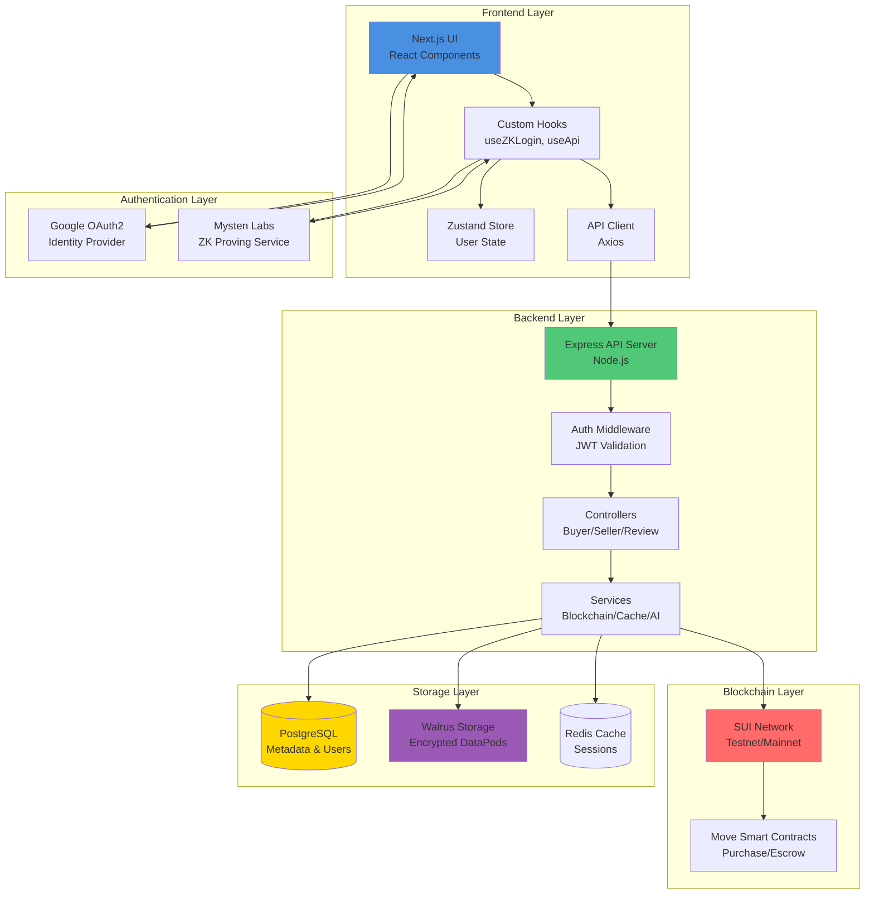
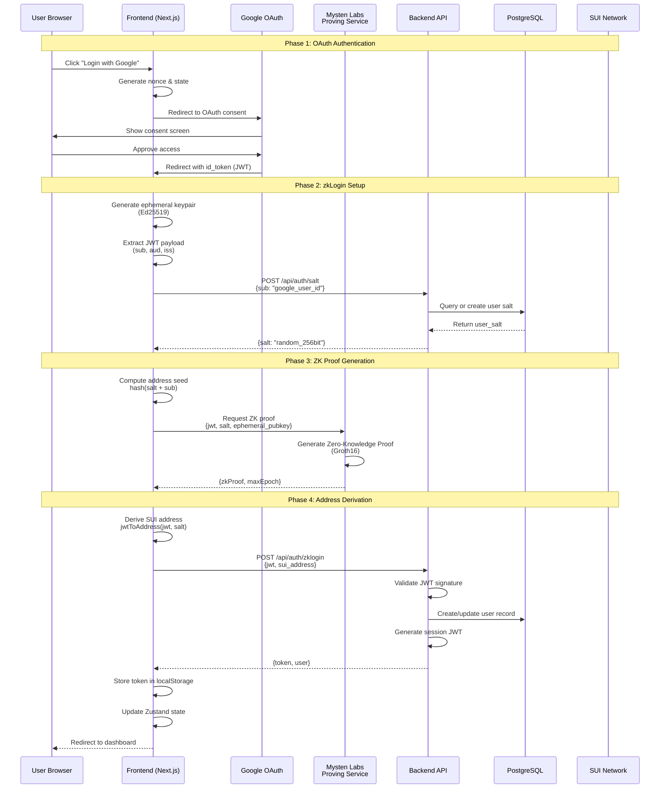
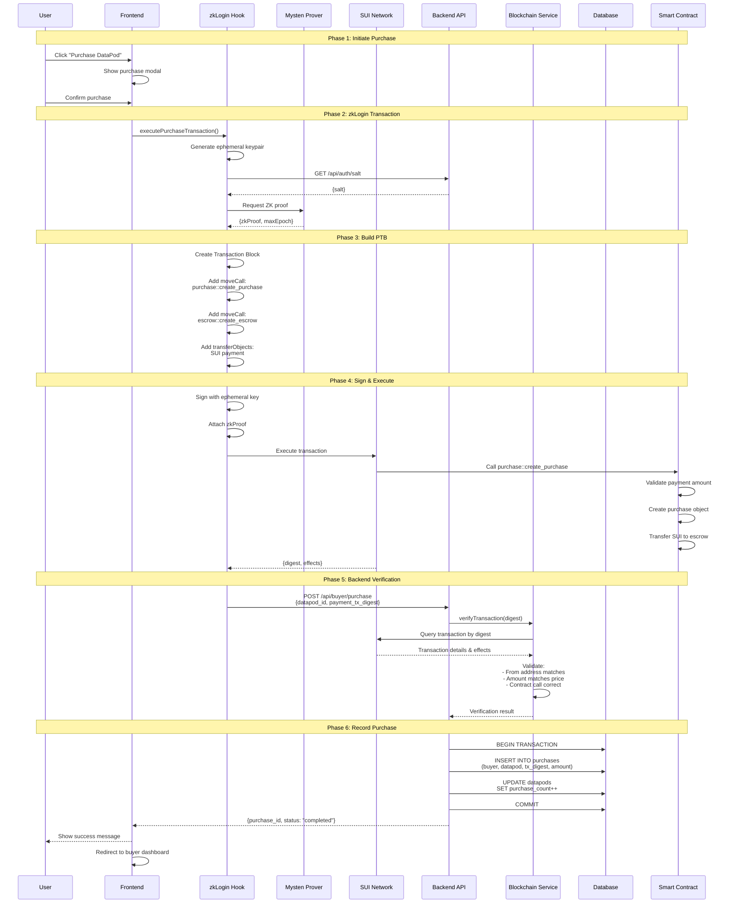
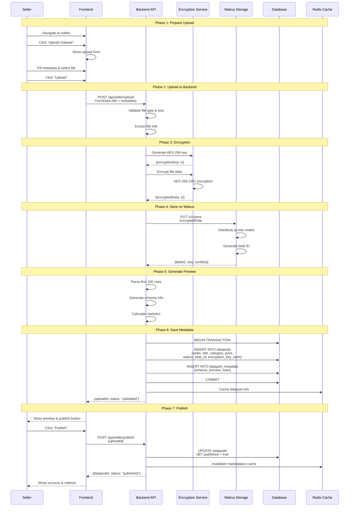
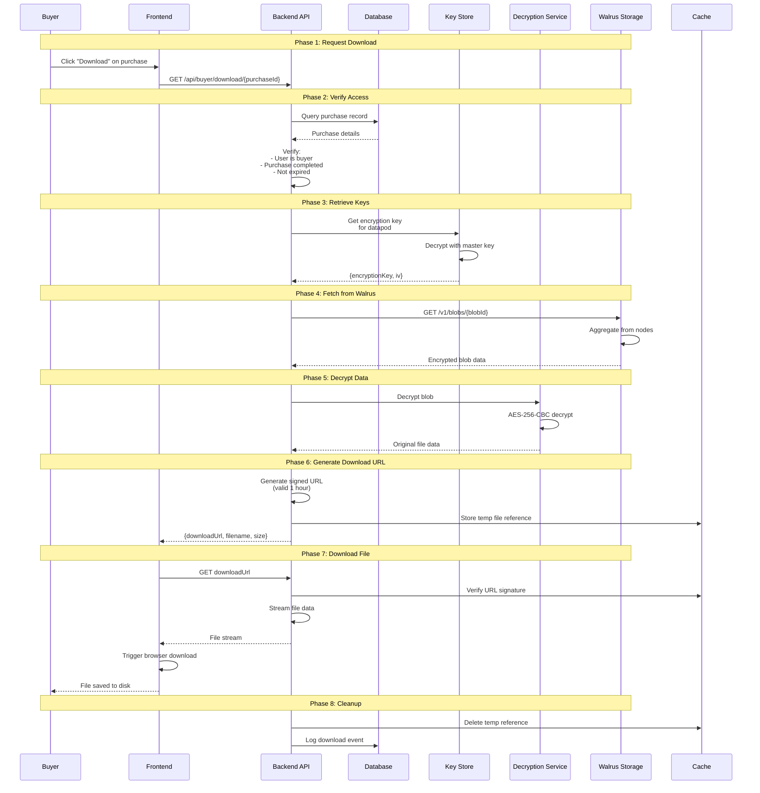
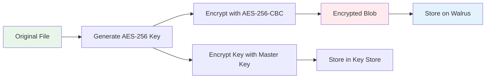
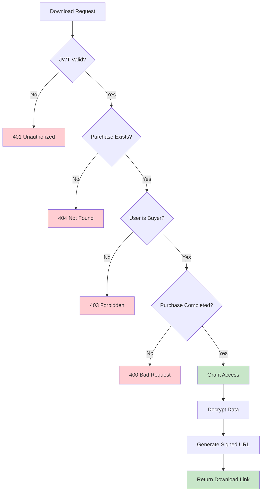

# SourceNet Frontend

<div align="center">


**A Decentralized Data Marketplace Built on SUI Blockchain**

[](https://nextjs.org/)
[](https://reactjs.org/)
[](https://www.typescriptlang.org/)
[](https://sui.io/)
[](LICENSE)

</div>

---

## 📖 Table of Contents

- [Overview](#-overview)
- [Key Features](#-key-features)
- [Quick Start](#-quick-start)
- [Environment Setup](#-environment-setup)
- [System Architecture](#-system-architecture)
- [Application Flows](#-application-flows)
  - [Authentication Flow](#1-authentication-flow---technical-deep-dive)
  - [DataPod Purchase Flow](#2-datapod-purchase-flow---complete-technical-flow)
  - [Seller Upload Flow](#3-seller-upload-flow---complete-technical-process)
  - [Download Flow](#4-download-flow---secure-data-delivery)
  - [AI Chat Flow](#5-ai-chat-flow---intelligent-assistance)
- [API Reference](#-api-endpoints-reference)
- [Database Schema](#-database-schema)
- [Security & Encryption](#-security--encryption-flow)
- [Project Structure](#-project-structure)
- [Technology Stack](#-technology-stack)
- [Development Guide](#-development-guide)
- [Troubleshooting](#-troubleshooting)
- [Contributing](#-contributing)
- [License](#-license)

---

## 🌟 Overview

SourceNet is a **decentralized data marketplace** that enables secure buying and selling of datasets with **privacy-preserving zkLogin authentication** and **encrypted data delivery**. Built on the SUI blockchain, it provides a trustless environment for data transactions with end-to-end encryption.

### Why SourceNet?

- 🔐 **Privacy-First**: zkLogin authentication eliminates private key management
- 🔒 **Secure Storage**: AES-256 encryption with Walrus distributed storage
- ⛓️ **Blockchain-Verified**: All transactions verified on SUI blockchain
- 🤖 **AI-Powered**: Integrated AI assistant for marketplace guidance
- 💰 **Fair Pricing**: Transparent pricing with escrow-based payments
- 📊 **Data Quality**: Review system ensures dataset quality

---

## ✨ Key Features

### For Buyers
- 🔍 **Browse & Discover**: Explore datasets across multiple categories
- 🛒 **Secure Purchases**: Blockchain-verified transactions with escrow
- 📥 **Instant Downloads**: Time-limited, encrypted download URLs
- ⭐ **Review System**: Rate and review purchased datasets
- 🤖 **AI Assistant**: Get help finding the right datasets

### For Sellers
- 📤 **Easy Upload**: Simple dataset upload with automatic encryption
- 💵 **Set Your Price**: Flexible pricing in SUI tokens
- 📈 **Analytics Dashboard**: Track sales and earnings
- 🔐 **Data Protection**: Automatic AES-256 encryption
- 🌐 **Global Reach**: Decentralized storage on Walrus

### Technical Features
- ⚡ **zkLogin Authentication**: Passwordless login via Google OAuth
- 🔗 **Smart Contracts**: Move-based purchase and escrow contracts
- 🗄️ **Distributed Storage**: Walrus for decentralized data storage
- 🔐 **End-to-End Encryption**: AES-256-CBC encryption
- 🌐 **Real-time Updates**: WebSocket support for live notifications
- 🎨 **Modern UI**: Responsive design with Tailwind CSS

---

## 🚀 Quick Start

### Prerequisites

- **Node.js** 18.x or higher
- **npm** or **yarn** package manager
- **Git** for version control

### Installation

```bash
# Clone the repository
git clone https://github.com/HusseinHato/sourcenet_fe.git
cd sourcenet_fe

# Install dependencies
npm install

# Set up environment variables
cp .env.example .env.local

# Start development server
npm run dev
```

Open [http://localhost:3000](http://localhost:3000) to access the application.

### Build for Production

```bash
# Create production build
npm run build

# Start production server
npm start
```

---

## 🔧 Environment Setup

### Required Environment Variables

Create a `.env.local` file in the root directory:

```env
# Backend API Configuration
NEXT_PUBLIC_API_URL=http://localhost:3001
NEXT_PUBLIC_BACKEND_URL=http://localhost:3001

# SUI Network Configuration
NEXT_PUBLIC_SUI_NETWORK=testnet
NEXT_PUBLIC_SUI_RPC_URL=https://fullnode.testnet.sui.io:443

# Google OAuth Configuration
NEXT_PUBLIC_GOOGLE_CLIENT_ID=your_google_client_id
NEXT_PUBLIC_REDIRECT_URI=http://localhost:3000/callback

# zkLogin Configuration
NEXT_PUBLIC_ZKLOGIN_PROVIDER=Google
NEXT_PUBLIC_MYSTEN_PROVER_URL=https://prover-dev.mystenlabs.com/v1

# Smart Contract Configuration
NEXT_PUBLIC_PACKAGE_ID=0x...
NEXT_PUBLIC_PURCHASE_REGISTRY=0x...

# Walrus Storage Configuration
NEXT_PUBLIC_WALRUS_PUBLISHER_URL=https://publisher.walrus-testnet.walrus.space
NEXT_PUBLIC_WALRUS_AGGREGATOR_URL=https://aggregator.walrus-testnet.walrus.space

# Application Configuration
NEXT_PUBLIC_APP_NAME=SourceNet
NEXT_PUBLIC_APP_URL=http://localhost:3000
```

### Google OAuth Setup

1. Go to [Google Cloud Console](https://console.cloud.google.com/)
2. Create a new project or select existing
3. Enable Google+ API
4. Create OAuth 2.0 credentials
5. Add authorized redirect URIs:
   - `http://localhost:3000/callback` (development)
   - `https://yourdomain.com/callback` (production)
6. Copy Client ID to `NEXT_PUBLIC_GOOGLE_CLIENT_ID`

### SUI Wallet Setup

For testing, you'll need SUI testnet tokens:

1. Install [SUI Wallet Extension](https://chrome.google.com/webstore/detail/sui-wallet)
2. Switch to Testnet network
3. Get testnet tokens from [SUI Faucet](https://discord.gg/sui)

---

## 🏗️ System Architecture

### Architecture Overview



### Complete User Journey Flow

```mermaid
graph LR
    A[Visit Site] --> B{Authenticated?}
    B -->|No| C[Login Page]
    B -->|Yes| D[Marketplace]
    
    C --> E[Google OAuth]
    E --> F[zkLogin Setup]
    F --> D
    
    D --> G{User Role?}
    
    G -->|Buyer| H[Browse DataPods]
    H --> I[View Details]
    I --> J[Purchase]
    J --> K[zkLogin Transaction]
    K --> L[Payment Verification]
    L --> M[Buyer Dashboard]
    M --> N[Download Data]
    
    G -->|Seller| O[Upload DataPod]
    O --> P[Encrypt & Store]
    P --> Q[Publish to Marketplace]
    Q --> R[Seller Dashboard]
    R --> S[View Analytics]
    
    M --> T[Submit Review]
    T --> U[Rating Recorded]
    
    style A fill:#E8F5E9
    style D fill:#FFF3E0
    style K fill:#FCE4EC
    style P fill:#E3F2FD
```



---

## 📋 Application Flows

### 1. **Authentication Flow - Technical Deep Dive**

#### Complete zkLogin Authentication Sequence



#### Authentication Implementation

**Frontend (`useZKLogin` hook)**:
```typescript
// 1. Generate ephemeral keypair
const ephemeralKeyPair = new Ed25519Keypair();

// 2. Request salt from backend
const { salt } = await fetch('/api/auth/salt', {
  method: 'POST',
  body: JSON.stringify({ sub: jwtPayload.sub })
});

// 3. Compute address seed
const addressSeed = genAddressSeed(
  BigInt(salt),
  'sub',
  jwtPayload.sub,
  jwtPayload.aud
);

// 4. Get ZK proof from Mysten Labs
const zkProof = await getZKProof(jwt, salt, ephemeralKeyPair);

// 5. Derive SUI address
const suiAddress = jwtToAddress(jwt, salt);

// 6. Authenticate with backend
const { token } = await api.authenticate(jwt, suiAddress);
```

**Backend (`AuthController`)**:
```typescript
// Validate JWT and create session
async zklogin(req, res) {
  // 1. Verify JWT signature (Google)
  const decoded = jwt.verify(idToken, googlePublicKey);
  
  // 2. Extract user info
  const { sub, email, name } = decoded;
  
  // 3. Find or create user in database
  const user = await User.findOrCreate({
    google_id: sub,
    email,
    name,
    sui_address: req.body.sui_address
  });
  
  // 4. Generate session JWT
  const token = jwt.sign(
    { userId: user.id, suiAddress: user.sui_address },
    process.env.JWT_SECRET,
    { expiresIn: '7d' }
  );
  
  res.json({ token, user });
}
```

---

### 2. **DataPod Purchase Flow - Complete Technical Flow**

#### Purchase Transaction Sequence



#### Purchase Transaction Details

**Frontend Transaction Building**:
```typescript
// Build Programmable Transaction Block
const tx = new Transaction();

// 1. Split SUI coins for payment
const [paymentCoin] = tx.splitCoins(tx.gas, [
  tx.pure(priceInMIST, 'u64')
]);

// 2. Call purchase contract
tx.moveCall({
  target: `${PACKAGE_ID}::purchase::create_purchase`,
  arguments: [
    tx.pure(datapodId, 'address'),
    tx.pure(buyerAddress, 'address'),
    paymentCoin,
    tx.pure(priceInMIST, 'u64')
  ]
});

// 3. Create escrow
tx.moveCall({
  target: `${PACKAGE_ID}::escrow::create_escrow`,
  arguments: [
    tx.object(PURCHASE_REGISTRY),
    paymentCoin,
    tx.pure(sellerAddress, 'address')
  ]
});

// 4. Sign with zkLogin
const signature = await signWithZK(tx, ephemeralKeyPair, zkProof);

// 5. Execute transaction
const result = await suiClient.executeTransactionBlock({
  transactionBlock: tx,
  signature,
  options: {
    showEffects: true,
    showObjectChanges: true
  }
});
```

**Backend Verification Logic**:
```typescript
async createPurchase(req, res) {
  const { datapod_id, payment_tx_digest } = req.body;
  const buyerId = req.user.id;
  
  // 1. Get DataPod details
  const datapod = await DataPod.findById(datapod_id);
  if (!datapod) throw new Error('DataPod not found');
  
  // 2. Verify blockchain transaction
  const txData = await BlockchainService.getTransaction(payment_tx_digest);
  
  // 3. Validate transaction
  if (!txData) throw new Error('Transaction not found');
  if (txData.effects.status.status !== 'success') {
    throw new Error('Transaction failed on-chain');
  }
  
  // 4. Verify payment amount
  const paidAmount = extractPaymentAmount(txData);
  const expectedAmount = datapod.price_sui * 1e9; // Convert to MIST
  
  if (paidAmount < expectedAmount) {
    throw new Error('Insufficient payment');
  }
  
  // 5. Verify sender address
  if (txData.sender !== req.user.sui_address) {
    throw new Error('Address mismatch');
  }
  
  // 6. Check for duplicate
  const existing = await Purchase.findOne({
    where: { payment_tx_digest }
  });
  if (existing) throw new Error('Purchase already recorded');
  
  // 7. Create purchase record
  const purchase = await Purchase.create({
    buyer_id: buyerId,
    datapod_id,
    payment_tx_digest,
    amount_sui: datapod.price_sui,
    status: 'completed'
  });
  
  // 8. Update analytics
  await DataPod.increment('purchase_count', {
    where: { id: datapod_id }
  });
  
  res.json({ purchase });
}
```

---

### 3. **Seller Upload Flow - Complete Technical Process**

#### Upload & Publish Sequence



#### Encryption & Storage Details

**Backend Upload Handler**:
```typescript
async uploadData(req, res) {
  const file = req.file; // Multer middleware
  const metadata = JSON.parse(req.body.metadata);
  const sellerId = req.user.id;
  
  // 1. Validate file
  if (!file) throw new Error('No file uploaded');
  if (file.size > 500 * 1024 * 1024) { // 500MB limit
    throw new Error('File too large');
  }
  
  // 2. Generate encryption key
  const encryptionKey = crypto.randomBytes(32); // 256-bit
  const iv = crypto.randomBytes(16);
  
  // 3. Encrypt file
  const cipher = crypto.createCipheriv('aes-256-cbc', encryptionKey, iv);
  const encryptedData = Buffer.concat([
    cipher.update(file.buffer),
    cipher.final()
  ]);
  
  // 4. Upload to Walrus
  const walrusResult = await WalrusService.store(encryptedData);
  
  // 5. Generate preview (on unencrypted data)
  const preview = await generatePreview(file.buffer, file.mimetype);
  
  // 6. Hash encryption key for storage
  const keyHash = crypto
    .createHash('sha256')
    .update(encryptionKey)
    .digest('hex');
  
  // 7. Store in database
  const datapod = await DataPod.create({
    seller_id: sellerId,
    title: metadata.title,
    description: metadata.description,
    category: metadata.category,
    price_sui: metadata.price,
    walrus_blob_id: walrusResult.blobId,
    walrus_storage_size: walrusResult.size,
    encryption_key_hash: keyHash,
    encryption_iv: iv.toString('hex'),
    file_type: file.mimetype,
    file_size: file.size,
    schema: preview.schema,
    sample_data: preview.sample,
    published: false
  });
  
  // 8. Store encryption key securely (encrypted with master key)
  await EncryptionKeyStore.save(datapod.id, encryptionKey);
  
  res.json({ uploadId: datapod.id });
}
```

---

### 4. **Download Flow - Secure Data Delivery**

#### Download Process Sequence



#### Download Security Implementation

**Backend Download Handler**:
```typescript
async getDownloadUrl(req, res) {
  const { purchaseId } = req.params;
  const userId = req.user.id;
  
  // 1. Verify purchase ownership
  const purchase = await Purchase.findOne({
    where: { id: purchaseId, buyer_id: userId },
    include: [{ model: DataPod, as: 'datapod' }]
  });
  
  if (!purchase) {
    return res.status(404).json({ error: 'Purchase not found' });
  }
  
  if (purchase.status !== 'completed') {
    return res.status(400).json({ error: 'Purchase not completed' });
  }
  
  // 2. Get encryption key
  const encryptionKey = await EncryptionKeyStore.get(
    purchase.datapod.id
  );
  const iv = Buffer.from(purchase.datapod.encryption_iv, 'hex');
  
  // 3. Fetch encrypted data from Walrus
  const encryptedBlob = await WalrusService.fetch(
    purchase.datapod.walrus_blob_id
  );
  
  // 4. Decrypt data
  const decipher = crypto.createDecipheriv(
    'aes-256-cbc',
    encryptionKey,
    iv
  );
  const decryptedData = Buffer.concat([
    decipher.update(encryptedBlob),
    decipher.final()
  ]);
  
  // 5. Generate signed download token
  const downloadToken = jwt.sign(
    {
      purchaseId,
      userId,
      filename: purchase.datapod.title,
      exp: Math.floor(Date.now() / 1000) + 3600 // 1 hour
    },
    process.env.DOWNLOAD_SECRET
  );
  
  // 6. Store temp file in cache
  await CacheService.set(
    `download:${downloadToken}`,
    decryptedData,
    3600 // 1 hour TTL
  );
  
  // 7. Generate download URL
  const downloadUrl = `${process.env.API_URL}/download/${downloadToken}`;
  
  // 8. Log download
  await DownloadLog.create({
    purchase_id: purchaseId,
    buyer_id: userId,
    datapod_id: purchase.datapod.id
  });
  
  res.json({
    downloadUrl,
    filename: purchase.datapod.title,
    size: purchase.datapod.file_size,
    expiresIn: 3600
  });
}
```

---

### 5. **AI Chat Flow - Intelligent Assistance**

#### AI Chat Integration

SourceNet includes an **AI-powered assistant** to help users navigate the marketplace, understand datasets, and make informed purchasing decisions.

**Features**:
- 💬 **Contextual Conversations**: AI understands the current page and DataPod context
- 📚 **Conversation History**: Maintains conversation threads
- 🔍 **Dataset Recommendations**: Suggests relevant datasets based on queries
- 📊 **Data Insights**: Explains dataset schemas and use cases
- 🎯 **Smart Search**: Natural language search for datasets

**Frontend Implementation (`useAiChat` hook)**:
```typescript
const { sendMessage, conversations, loading } = useAiChat();

// Send message with context
await sendMessage({
  message: "What datasets are available for financial analysis?",
  context: {
    page: 'marketplace',
    dataPodId: currentDataPodId
  }
});
```

**API Endpoints**:
- `POST /api/ai/chat` - Send message and get AI response
- `GET /api/ai/conversations` - List user's conversations
- `GET /api/ai/conversations/:id` - Get conversation details
- `DELETE /api/ai/conversations/:id` - Delete conversation

---

## 🔌 API Endpoints Reference

### Authentication Endpoints

| Endpoint | Method | Auth | Description |
|----------|--------|------|-------------|
| `/api/auth/salt` | POST | No | Get or create user salt for zkLogin |
| `/api/auth/zklogin` | POST | No | Authenticate with Google JWT + zkLogin |
| `/api/auth/me` | GET | Yes | Get current user info |
| `/api/auth/profile` | PUT | Yes | Update user profile |

### Marketplace Endpoints

| Endpoint | Method | Auth | Description |
|----------|--------|------|-------------|
| `/api/marketplace/datapods` | GET | No | List all published DataPods |
| `/api/marketplace/datapods/:id` | GET | No | Get DataPod details |
| `/api/marketplace/top-rated` | GET | No | Get top rated DataPods |
| `/api/marketplace/categories` | GET | No | List all categories |
| `/api/marketplace/search` | GET | No | Search DataPods by query |

### Seller Endpoints

| Endpoint | Method | Auth | Description |
|----------|--------|------|-------------|
| `/api/seller/upload` | POST | Yes | Upload new dataset |
| `/api/seller/publish` | POST | Yes | Publish uploaded DataPod |
| `/api/seller/datapods` | GET | Yes | List seller's DataPods |
| `/api/seller/datapods/:id` | PUT | Yes | Update DataPod metadata |
| `/api/seller/datapods/:id` | DELETE | Yes | Delete DataPod |
| `/api/seller/stats` | GET | Yes | Get seller analytics |

### Buyer Endpoints

| Endpoint | Method | Auth | Description |
|----------|--------|------|-------------|
| `/api/buyer/purchase` | POST | Yes | Record purchase after on-chain tx |
| `/api/buyer/purchases` | GET | Yes | List buyer's purchases |
| `/api/buyer/purchase/:id` | GET | Yes | Get purchase details |
| `/api/buyer/download/:id` | GET | Yes | Get download URL for purchase |
| `/api/buyer/purchase/:id/review` | POST | Yes | Submit review for purchase |

### Review Endpoints

| Endpoint | Method | Auth | Description |
|----------|--------|------|-------------|
| `/api/review/my-reviews` | GET | Yes | List user's reviews |
| `/api/review/datapod/:id` | GET | No | Get reviews for DataPod |
| `/api/review/:id` | PUT | Yes | Update own review |
| `/api/review/:id` | DELETE | Yes | Delete own review |

### AI Endpoints

| Endpoint | Method | Auth | Description |
|----------|--------|------|-------------|
| `/api/ai/chat` | POST | Yes | Send message to AI assistant |
| `/api/ai/conversations` | GET | Yes | List user's conversations |
| `/api/ai/conversations/:id` | GET | Yes | Get conversation details |
| `/api/ai/conversations/:id` | DELETE | Yes | Delete conversation |

### Wallet Endpoints

| Endpoint | Method | Auth | Description |
|----------|--------|------|-------------|
| `/api/wallet/balance` | GET | Yes | Get wallet SUI balance |
| `/api/wallet/transactions` | GET | Yes | List wallet transactions |

---

## 💾 Database Schema

### Core Tables

```sql
-- Users table
CREATE TABLE users (
    id UUID PRIMARY KEY DEFAULT gen_random_uuid(),
    google_id VARCHAR(255) UNIQUE NOT NULL,
    email VARCHAR(255) UNIQUE NOT NULL,
    name VARCHAR(255),
    sui_address VARCHAR(66) UNIQUE NOT NULL,
    salt VARCHAR(64) NOT NULL, -- zkLogin salt
    profile_image VARCHAR(500),
    bio TEXT,
    created_at TIMESTAMP DEFAULT NOW(),
    updated_at TIMESTAMP DEFAULT NOW()
);

-- DataPods table
CREATE TABLE datapods (
    id UUID PRIMARY KEY DEFAULT gen_random_uuid(),
    seller_id UUID REFERENCES users(id) ON DELETE CASCADE,
    title VARCHAR(255) NOT NULL,
    description TEXT,
    category VARCHAR(50) NOT NULL,
    price_sui DECIMAL(20, 9) NOT NULL,
    walrus_blob_id VARCHAR(255) UNIQUE NOT NULL,
    walrus_storage_size BIGINT,
    encryption_key_hash VARCHAR(64) NOT NULL,
    encryption_iv VARCHAR(32) NOT NULL,
    file_type VARCHAR(100),
    file_size BIGINT,
    preview JSONB, -- Sample data preview
    schema JSONB, -- Dataset schema
    published BOOLEAN DEFAULT false,
    purchase_count INTEGER DEFAULT 0,
    average_rating DECIMAL(3, 2) DEFAULT 0,
    created_at TIMESTAMP DEFAULT NOW(),
    updated_at TIMESTAMP DEFAULT NOW(),
    
    INDEX idx_category (category),
    INDEX idx_published (published),
    INDEX idx_seller (seller_id)
);

-- Purchases table
CREATE TABLE purchases (
    id UUID PRIMARY KEY DEFAULT gen_random_uuid(),
    buyer_id UUID REFERENCES users(id) ON DELETE CASCADE,
    datapod_id UUID REFERENCES datapods(id) ON DELETE CASCADE,
    payment_tx_digest VARCHAR(100) UNIQUE NOT NULL,
    amount_sui DECIMAL(20, 9) NOT NULL,
    status VARCHAR(20) DEFAULT 'pending_payment',
    created_at TIMESTAMP DEFAULT NOW(),
    updated_at TIMESTAMP DEFAULT NOW(),
    
    INDEX idx_buyer (buyer_id),
    INDEX idx_datapod (datapod_id),
    INDEX idx_status (status)
);

-- Reviews table
CREATE TABLE reviews (
    id UUID PRIMARY KEY DEFAULT gen_random_uuid(),
    purchase_id UUID REFERENCES purchases(id) ON DELETE CASCADE UNIQUE,
    buyer_id UUID REFERENCES users(id) ON DELETE CASCADE,
    datapod_id UUID REFERENCES datapods(id) ON DELETE CASCADE,
    rating INTEGER CHECK (rating >= 1 AND rating <= 5) NOT NULL,
    comment TEXT,
    created_at TIMESTAMP DEFAULT NOW(),
    updated_at TIMESTAMP DEFAULT NOW(),
    
    INDEX idx_datapod (datapod_id),
    INDEX idx_buyer (buyer_id)
);

-- Download logs
CREATE TABLE download_logs (
    id UUID PRIMARY KEY DEFAULT gen_random_uuid(),
    purchase_id UUID REFERENCES purchases(id) ON DELETE CASCADE,
    buyer_id UUID REFERENCES users(id) ON DELETE CASCADE,
    datapod_id UUID REFERENCES datapods(id) ON DELETE CASCADE,
    downloaded_at TIMESTAMP DEFAULT NOW(),
    
    INDEX idx_purchase (purchase_id)
);

-- AI Conversations
CREATE TABLE ai_conversations (
    id UUID PRIMARY KEY DEFAULT gen_random_uuid(),
    user_id UUID REFERENCES users(id) ON DELETE CASCADE,
    title VARCHAR(255),
    created_at TIMESTAMP DEFAULT NOW(),
    updated_at TIMESTAMP DEFAULT NOW(),
    
    INDEX idx_user (user_id)
);

-- AI Messages
CREATE TABLE ai_messages (
    id UUID PRIMARY KEY DEFAULT gen_random_uuid(),
    conversation_id UUID REFERENCES ai_conversations(id) ON DELETE CASCADE,
    role VARCHAR(20) NOT NULL, -- 'user' or 'assistant'
    content TEXT NOT NULL,
    tokens_used INTEGER,
    created_at TIMESTAMP DEFAULT NOW(),
    
    INDEX idx_conversation (conversation_id)
);
```

### Database Indexes

For optimal performance, the following indexes are created:

- **Users**: `google_id`, `email`, `sui_address`
- **DataPods**: `category`, `published`, `seller_id`
- **Purchases**: `buyer_id`, `datapod_id`, `status`, `payment_tx_digest`
- **Reviews**: `datapod_id`, `buyer_id`, `purchase_id`
- **Download Logs**: `purchase_id`
- **AI Conversations**: `user_id`
- **AI Messages**: `conversation_id`

---

## 🔐 Security & Encryption Flow

### Encryption at Rest



### Key Management

- **Master Encryption Key**: Stored in environment variables (`MASTER_ENCRYPTION_KEY`)
- **Per-DataPod Keys**: Randomly generated AES-256 keys (32 bytes)
- **Key Storage**: Encrypted with master key before database storage
- **IV (Initialization Vector)**: Unique per DataPod (16 bytes), stored in database
- **Key Rotation**: Manual rotation supported via admin API
- **Key Derivation**: PBKDF2 with 100,000 iterations for master key

### Access Control Flow



### Security Best Practices

1. **Authentication**
   - JWT tokens with 7-day expiration
   - Secure httpOnly cookies for sensitive data
   - CSRF protection on all state-changing endpoints

2. **Data Protection**
   - AES-256-CBC encryption for all datasets
   - Unique encryption keys per DataPod
   - Master key stored in secure environment variables

3. **Access Control**
   - Role-based access control (RBAC)
   - Purchase verification before download
   - Time-limited download URLs (1 hour)

4. **Network Security**
   - HTTPS only in production
   - CORS configured for trusted origins
   - Rate limiting on API endpoints

5. **Blockchain Security**
   - Transaction verification on SUI network
   - Escrow-based payments
   - Smart contract auditing

---

## 📁 Project Structure

```
sourcenet_fe/
├── app/                          # Next.js App Router
│   ├── (auth)/                   # Authentication pages (route group)
│   │   ├── login/               # Google OAuth login page
│   │   ├── callback/            # OAuth callback handler
│   │   └── wallet-login/        # Alternative wallet authentication
│   │
│   ├── (main)/                   # Main application pages (route group)
│   │   ├── dashboard/           # Main dashboard
│   │   │   └── wallet/          # Wallet management page
│   │   ├── buyer/               # Buyer dashboard & purchases
│   │   ├── seller/              # Seller dashboard & uploads
│   │   ├── datapod/[id]/        # DataPod detail page (dynamic route)
│   │   ├── profile/             # User profile management
│   │   │   └── reviews/         # User's reviews
│   │   ├── review/              # Review submission
│   │   ├── store/               # Marketplace/store page
│   │   └── demo-loading/        # Loading animation demo
│   │
│   ├── components/               # Reusable UI components
│   │   ├── ai/                  # AI chat components
│   │   │   ├── AiChatWindow.tsx
│   │   │   └── AiLoadingAnimation.tsx
│   │   ├── buyer/               # Buyer-specific components
│   │   ├── common/              # Shared components
│   │   │   ├── Button.tsx
│   │   │   ├── Card.tsx
│   │   │   ├── Input.tsx
│   │   │   └── Modal.tsx
│   │   ├── layout/              # Layout components
│   │   │   ├── Footer.tsx
│   │   │   └── Navbar.tsx
│   │   ├── marketplace/         # Marketplace components
│   │   │   ├── DataPodCard.tsx
│   │   │   ├── DataPodGrid.tsx
│   │   │   └── FilterBar.tsx
│   │   ├── review/              # Review components
│   │   ├── seller/              # Seller-specific components
│   │   ├── wallet/              # Wallet components
│   │   ├── providers/           # Context providers
│   │   │   └── SuiProvider.tsx
│   │   └── ParticlesBackground.tsx
│   │
│   ├── hooks/                    # Custom React hooks
│   │   ├── index.ts             # Hook exports
│   │   ├── useAiChat.ts         # AI chat functionality
│   │   ├── useApi.ts            # API client hooks
│   │   ├── useAuthPersistence.ts # Auth state persistence
│   │   ├── useEncryption.ts     # Client-side encryption
│   │   ├── useWalletAuth.ts     # Wallet authentication
│   │   ├── useWebSocket.ts      # WebSocket connections
│   │   └── useZKLogin.ts        # zkLogin authentication
│   │
│   ├── utils/                    # Utility functions
│   │   ├── ai.service.ts        # AI service client
│   │   ├── api.client.ts        # Axios API client
│   │   ├── crypto.utils.ts      # Cryptography utilities
│   │   ├── encryption.ts        # Encryption helpers
│   │   ├── format.utils.ts      # Formatting utilities
│   │   ├── keyStorage.ts        # Local key storage
│   │   ├── review.client.ts     # Review API client
│   │   ├── validators.utils.ts  # Input validation
│   │   └── zklogin.utils.ts     # zkLogin helpers
│   │
│   ├── types/                    # TypeScript type definitions
│   │   ├── ai.types.ts          # AI chat types
│   │   ├── api.types.ts         # API response types
│   │   ├── datapod.types.ts     # DataPod types
│   │   ├── purchase.types.ts    # Purchase types
│   │   ├── review.types.ts      # Review types
│   │   └── user.types.ts        # User types
│   │
│   ├── layout.tsx                # Root layout
│   ├── globals.css               # Global styles
│   └── favicon.ico               # Favicon
│
├── public/                       # Static assets
│   ├── sourcenet.png            # Logo
│   └── *.svg                    # SVG icons
│
├── components/                   # shadcn/ui components
│   └── ui/                      # UI primitives
│
├── lib/                          # Library configurations
│   └── utils.ts                 # Utility functions
│
├── .env.local                    # Environment variables (gitignored)
├── .env.example                  # Environment template
├── .gitignore                    # Git ignore rules
├── components.json               # shadcn/ui config
├── eslint.config.mjs             # ESLint configuration
├── next.config.ts                # Next.js configuration
├── package.json                  # Dependencies
├── postcss.config.mjs            # PostCSS configuration
├── tailwind.config.ts            # Tailwind CSS configuration
├── tsconfig.json                 # TypeScript configuration
└── README.md                     # This file
```

### Key Directories Explained

- **`app/(auth)/`**: Authentication-related pages using Next.js route groups
- **`app/(main)/`**: Main application pages protected by authentication
- **`app/components/`**: Reusable React components organized by feature
- **`app/hooks/`**: Custom React hooks for state management and side effects
- **`app/utils/`**: Utility functions and service clients
- **`app/types/`**: TypeScript type definitions and interfaces
- **`public/`**: Static assets served directly
- **`components/ui/`**: shadcn/ui component library

---

## 🛠️ Technology Stack

### Frontend Framework
- **Next.js 16.0** - React framework with App Router
- **React 19.2** - UI library with latest features
- **TypeScript 5.x** - Type-safe JavaScript

### Styling & UI
- **Tailwind CSS 4.x** - Utility-first CSS framework
- **Framer Motion 12.x** - Animation library
- **Lucide React** - Icon library
- **shadcn/ui** - Reusable component library
- **class-variance-authority** - Component variants
- **clsx** - Conditional classnames

### Blockchain & Web3
- **@mysten/sui 1.45** - SUI SDK
- **@mysten/dapp-kit 0.14** - SUI dApp utilities
- **@tanstack/react-query 5.28** - Data fetching and caching

### State Management
- **Zustand 4.4** - Lightweight state management
- **React Query** - Server state management

### Cryptography
- **crypto-js 4.2** - Cryptographic functions
- **tweetnacl 1.0** - NaCl cryptography
- **tweetnacl-util** - Encoding utilities
- **libsodium** - Modern cryptography
- **js-sha256** - SHA-256 hashing
- **@stablelib/base64** - Base64 encoding

### HTTP & API
- **Axios 1.6** - HTTP client
- **WebSocket** - Real-time communication

### Utilities
- **date-fns 2.30** - Date manipulation
- **react-markdown 10.1** - Markdown rendering
- **remark-gfm 4.0** - GitHub Flavored Markdown
- **rehype-raw 7.0** - Raw HTML in markdown

### Graphics & Visualization
- **OGL 1.0** - WebGL library for particles background

### Development Tools
- **ESLint 9.x** - Code linting
- **TypeScript** - Type checking
- **PostCSS** - CSS processing

---

## 👨‍💻 Development Guide

### Getting Started

1. **Clone the repository**
   ```bash
   git clone https://github.com/HusseinHato/sourcenet_fe.git
   cd sourcenet_fe
   ```

2. **Install dependencies**
   ```bash
   npm install
   ```

3. **Set up environment variables**
   ```bash
   cp .env.example .env.local
   # Edit .env.local with your configuration
   ```

4. **Start development server**
   ```bash
   npm run dev
   ```

### Available Scripts

```bash
# Development
npm run dev          # Start dev server on http://localhost:3000

# Production
npm run build        # Create production build
npm start            # Start production server

# Code Quality
npm run lint         # Run ESLint
npm run type-check   # Run TypeScript compiler check
```

### Code Style Guidelines

#### TypeScript
- Use **TypeScript** for all new files
- Define interfaces for all data structures
- Avoid `any` type; use `unknown` when type is uncertain
- Use strict mode

#### React Components
- Use **functional components** with hooks
- Prefer **named exports** over default exports
- Keep components **small and focused** (< 200 lines)
- Use **TypeScript interfaces** for props

Example:
```typescript
interface DataPodCardProps {
  datapod: DataPod;
  onPurchase: (id: string) => void;
}

export function DataPodCard({ datapod, onPurchase }: DataPodCardProps) {
  // Component implementation
}
```

#### File Naming
- **Components**: PascalCase (e.g., `DataPodCard.tsx`)
- **Hooks**: camelCase with `use` prefix (e.g., `useZKLogin.ts`)
- **Utils**: camelCase (e.g., `api.client.ts`)
- **Types**: camelCase with `.types.ts` suffix (e.g., `datapod.types.ts`)

#### CSS & Styling
- Use **Tailwind CSS** utility classes
- Create custom components in `components/ui/` for reusable patterns
- Use **CSS modules** for component-specific styles if needed
- Follow **mobile-first** responsive design

#### State Management
- Use **Zustand** for global state
- Use **React Query** for server state
- Use **useState** for local component state
- Use **useReducer** for complex local state

### Adding New Features

1. **Create feature branch**
   ```bash
   git checkout -b feature/your-feature-name
   ```

2. **Implement feature**
   - Add types in `app/types/`
   - Create components in `app/components/`
   - Add hooks if needed in `app/hooks/`
   - Update API client in `app/utils/`

3. **Test thoroughly**
   - Test authentication flow
   - Test blockchain transactions
   - Test UI responsiveness
   - Test error handling

4. **Commit and push**
   ```bash
   git add .
   git commit -m "feat: add your feature description"
   git push origin feature/your-feature-name
   ```

5. **Create pull request**

### Testing Strategy

#### Manual Testing Checklist
- [ ] Authentication flow (Google OAuth + zkLogin)
- [ ] Marketplace browsing and filtering
- [ ] DataPod purchase flow
- [ ] Download functionality
- [ ] Review submission
- [ ] Seller upload flow
- [ ] Wallet integration
- [ ] AI chat functionality
- [ ] Responsive design (mobile, tablet, desktop)
- [ ] Error handling and edge cases

#### Browser Testing
- Chrome (latest)
- Firefox (latest)
- Safari (latest)
- Edge (latest)

### Performance Optimization

1. **Code Splitting**
   - Use dynamic imports for large components
   - Lazy load routes

2. **Image Optimization**
   - Use Next.js Image component
   - Optimize images before upload
   - Use WebP format when possible

3. **Bundle Size**
   - Analyze bundle with `npm run build`
   - Remove unused dependencies
   - Use tree-shaking

4. **Caching**
   - Implement proper cache headers
   - Use React Query for data caching
   - Cache static assets

---

## 🐛 Troubleshooting

### Common Issues

#### 1. **zkLogin Authentication Fails**

**Problem**: User cannot log in with Google OAuth

**Solutions**:
- Verify `NEXT_PUBLIC_GOOGLE_CLIENT_ID` is correct
- Check redirect URI matches Google Console configuration
- Ensure backend `/api/auth/salt` endpoint is accessible
- Check browser console for CORS errors
- Verify Mysten Labs prover service is accessible

```bash
# Test backend connectivity
curl http://localhost:3001/api/auth/salt -X POST \
  -H "Content-Type: application/json" \
  -d '{"sub":"test"}'
```

#### 2. **Transaction Fails on SUI Network**

**Problem**: Purchase transaction fails or times out

**Solutions**:
- Check SUI network status (testnet/mainnet)
- Verify wallet has sufficient SUI balance
- Check gas price and limits
- Verify smart contract addresses are correct
- Check transaction in SUI Explorer

```typescript
// Debug transaction
console.log('Transaction digest:', txDigest);
console.log('SUI Explorer:', `https://suiexplorer.com/txblock/${txDigest}?network=testnet`);
```

#### 3. **Download Fails**

**Problem**: Cannot download purchased DataPod

**Solutions**:
- Verify purchase is completed
- Check Walrus storage is accessible
- Verify encryption keys are stored correctly
- Check download URL hasn't expired (1 hour limit)
- Verify backend has access to master encryption key

```bash
# Test Walrus connectivity
curl https://aggregator.walrus-testnet.walrus.space/v1/blobs/{blobId}
```

#### 4. **Build Errors**

**Problem**: `npm run build` fails

**Solutions**:
- Clear `.next` directory: `rm -rf .next`
- Clear node_modules: `rm -rf node_modules && npm install`
- Check TypeScript errors: `npx tsc --noEmit`
- Verify all environment variables are set
- Check for circular dependencies

```bash
# Clean build
rm -rf .next node_modules
npm install
npm run build
```

#### 5. **API Connection Issues**

**Problem**: Frontend cannot connect to backend

**Solutions**:
- Verify backend is running on correct port (3001)
- Check `NEXT_PUBLIC_API_URL` in `.env.local`
- Verify CORS is configured on backend
- Check network firewall settings
- Test API directly with curl

```bash
# Test API connectivity
curl http://localhost:3001/api/marketplace/datapods
```

#### 6. **Styling Issues**

**Problem**: Tailwind CSS not working

**Solutions**:
- Verify `tailwind.config.ts` is correct
- Check `globals.css` imports Tailwind directives
- Clear Next.js cache: `rm -rf .next`
- Restart development server

#### 7. **WebSocket Connection Fails**

**Problem**: Real-time updates not working

**Solutions**:
- Verify WebSocket URL is correct
- Check backend WebSocket server is running
- Verify firewall allows WebSocket connections
- Check browser console for connection errors

### Debug Mode

Enable debug logging:

```typescript
// In .env.local
NEXT_PUBLIC_DEBUG=true

// In code
if (process.env.NEXT_PUBLIC_DEBUG === 'true') {
  console.log('Debug info:', data);
}
```

### Getting Help

If you encounter issues not covered here:

1. Check [GitHub Issues](https://github.com/HusseinHato/sourcenet_fe/issues)
2. Search [SUI Documentation](https://docs.sui.io/)
3. Join [SUI Discord](https://discord.gg/sui)
4. Create a new issue with:
   - Error message
   - Steps to reproduce
   - Environment details (OS, Node version, etc.)
   - Screenshots if applicable

---

## 🤝 Contributing

We welcome contributions to SourceNet! Here's how you can help:

### Ways to Contribute

- 🐛 **Report bugs** - Create detailed bug reports
- ✨ **Suggest features** - Propose new features or improvements
- 📝 **Improve documentation** - Fix typos, add examples
- 💻 **Submit code** - Fix bugs or implement features
- 🎨 **Design improvements** - Enhance UI/UX

### Contribution Process

1. **Fork the repository**
   ```bash
   git clone https://github.com/YOUR_USERNAME/sourcenet_fe.git
   ```

2. **Create a feature branch**
   ```bash
   git checkout -b feature/amazing-feature
   ```

3. **Make your changes**
   - Follow code style guidelines
   - Add comments for complex logic
   - Update documentation if needed

4. **Test your changes**
   - Test all affected features
   - Ensure no regressions
   - Test on multiple browsers

5. **Commit your changes**
   ```bash
   git commit -m "feat: add amazing feature"
   ```

   Use conventional commits:
   - `feat:` - New feature
   - `fix:` - Bug fix
   - `docs:` - Documentation changes
   - `style:` - Code style changes
   - `refactor:` - Code refactoring
   - `test:` - Test additions/changes
   - `chore:` - Build process or auxiliary tool changes

6. **Push to your fork**
   ```bash
   git push origin feature/amazing-feature
   ```

7. **Create Pull Request**
   - Provide clear description
   - Reference related issues
   - Add screenshots for UI changes

### Code Review Process

1. Maintainers will review your PR
2. Address any requested changes
3. Once approved, PR will be merged
4. Your contribution will be credited

### Development Setup for Contributors

```bash
# Fork and clone
git clone https://github.com/YOUR_USERNAME/sourcenet_fe.git
cd sourcenet_fe

# Add upstream remote
git remote add upstream https://github.com/HusseinHato/sourcenet_fe.git

# Install dependencies
npm install

# Create .env.local
cp .env.example .env.local

# Start development
npm run dev
```

### Syncing with Upstream

```bash
# Fetch upstream changes
git fetch upstream

# Merge upstream main
git checkout main
git merge upstream/main

# Push to your fork
git push origin main
```

---

## 🔗 Related Repositories

- **Backend API**: [sourcenet-backend](https://github.com/HusseinHato/sourcenet-backend) - Express.js API server
- **Smart Contracts**: [sourcenet-contracts](https://github.com/HusseinHato/sourcenet-contracts) - SUI Move contracts
- **Indexer**: [sourcenet-indexer](https://github.com/HusseinHato/sourcenet-indexer) - Blockchain event indexer
- **Documentation**: [sourcenet-docs](https://github.com/HusseinHato/sourcenet-docs) - Comprehensive documentation

---

## 📄 License

This project is licensed under the **MIT License** - see the [LICENSE](LICENSE) file for details.

```
MIT License

Copyright (c) 2024 SourceNet

Permission is hereby granted, free of charge, to any person obtaining a copy
of this software and associated documentation files (the "Software"), to deal
in the Software without restriction, including without limitation the rights
to use, copy, modify, merge, publish, distribute, sublicense, and/or sell
copies of the Software, and to permit persons to whom the Software is
furnished to do so, subject to the following conditions:

The above copyright notice and this permission notice shall be included in all
copies or substantial portions of the Software.

THE SOFTWARE IS PROVIDED "AS IS", WITHOUT WARRANTY OF ANY KIND, EXPRESS OR
IMPLIED, INCLUDING BUT NOT LIMITED TO THE WARRANTIES OF MERCHANTABILITY,
FITNESS FOR A PARTICULAR PURPOSE AND NONINFRINGEMENT. IN NO EVENT SHALL THE
AUTHORS OR COPYRIGHT HOLDERS BE LIABLE FOR ANY CLAIM, DAMAGES OR OTHER
LIABILITY, WHETHER IN AN ACTION OF CONTRACT, TORT OR OTHERWISE, ARISING FROM,
OUT OF OR IN CONNECTION WITH THE SOFTWARE OR THE USE OR OTHER DEALINGS IN THE
SOFTWARE.
```

---

## 🙏 Acknowledgments

- **SUI Foundation** - For the amazing blockchain platform
- **Mysten Labs** - For zkLogin technology
- **Walrus Team** - For decentralized storage solution
- **Next.js Team** - For the excellent React framework
- **Open Source Community** - For all the amazing libraries

---

## 📞 Contact & Support

- **Website**: [sourcenet.io](https://sourcenet.io)
- **Email**: support@sourcenet.io
- **Twitter**: [@SourceNetIO](https://twitter.com/SourceNetIO)
- **Discord**: [Join our community](https://discord.gg/sourcenet)
- **GitHub**: [HusseinHato/sourcenet_fe](https://github.com/HusseinHato/sourcenet_fe)

---

<div align="center">

**Built with ❤️ by the SourceNet Team**

[⬆ Back to Top](#sourcenet-frontend)

</div>
